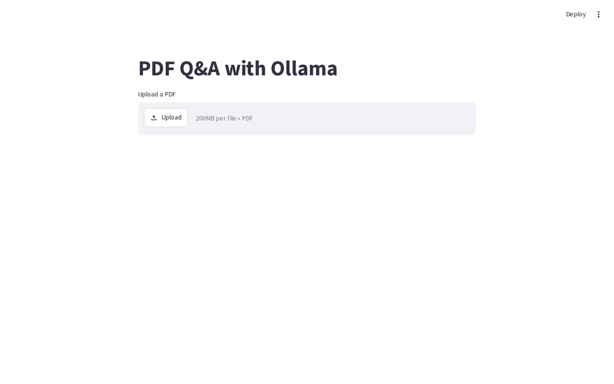
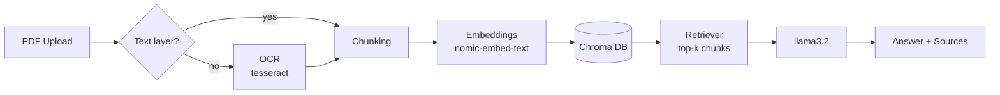

<div align="center">

# PDF Q&A with Ollama

**Chat with your PDFs — 100% local, 100% private.**

A Retrieval-Augmented Generation (RAG) app that answers questions about any PDF
using locally running models. No API keys, no cloud, no data leaving your machine.


[](LICENSE)



</div>

## How It Works



| Stage | Tool |
|---|---|
| Text extraction / OCR | `pdfplumber` · `pymupdf` + `tesseract` |
| Chunking | `RecursiveCharacterTextSplitter` (500 chars, 50 overlap) |
| Embeddings | `nomic-embed-text` via Ollama |
| Vector store | Chroma |
| Answer generation | `llama3.2` via Ollama |

## Features

- **Web UI** — upload a PDF in the browser and start asking
- **OCR fallback** — scanned PDFs without a text layer are OCR'd automatically
- **Per-PDF isolation** — every upload gets its own vector collection; documents never contaminate each other
- **Source pages** — every answer shows the exact pages it came from
- **Graceful failures** — clear messages when Ollama isn't running, models aren't pulled, or a PDF can't be parsed
- **Persistent CLI demo** — `rag_demo.py` builds a reusable local database
- **Fully offline** — models run on your hardware via Ollama

## Setup

**Prerequisites**

- Python 3.10+
- [Ollama](https://ollama.com/download)
- Tesseract OCR (optional, only for scanned PDFs)

```bash
# Arch Linux
sudo pacman -S ollama tesseract tesseract-data-eng

# Debian / Ubuntu
sudo apt install ollama tesseract-ocr
```

**Install**

```bash
git clone https://github.com/A7mad-PSE/RAG_project.git
cd RAG_project

python -m venv .venv
.venv/bin/pip install -r requirements.txt

# Pull the models (~2.3 GB total)
ollama pull llama3.2
ollama pull nomic-embed-text
```

## Run

```bash
# Start Ollama (if not already running as a service)
ollama serve
```

> Running Ollama on another machine or port? Set `OLLAMA_HOST` (e.g. `OLLAMA_HOST=http://192.168.1.20:11434`).

**Web app**

```bash
.venv/bin/streamlit run app.py
```

Opens at `http://localhost:8501` — upload a PDF and ask away.

**CLI demo**

```bash
.venv/bin/python rag_demo.py
```

> Uses `constitution.pdf` by default — drop in your own PDF and update the path at the top of the script.

## Project Structure

```
RAG_project/
├── app.py              # Streamlit web app
├── rag_demo.py         # CLI demo with persistent vector DB
├── utils.py            # shared Ollama health check
├── requirements.txt    # pinned dependency versions
├── LICENSE             # MIT
├── assets/demo.gif     # demo animation (shown above)
├── chroma_db/          # generated at runtime (gitignored)
└── .venv/              # virtual environment (gitignored)
```

## Limitations & Notes

| | |
|---|---|
| Handwritten PDFs | Not supported — classic OCR can't read handwriting reliably |
| First question latency | Models load into RAM on first use (~10–30 s), then fast |
| RAM footprint | ~3 GB while running (`llama3.2` 2 GB + embeddings) |
| Hardware | Runs fine on CPU, but significantly faster with CUDA (NVIDIA) or Metal (Apple) — Ollama uses the GPU automatically when available |
| Broad "summarize the whole document" questions | Answers are built from ~500-char retrieved chunks — specific questions work best; very broad ones may get a cautious answer |
